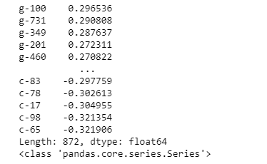
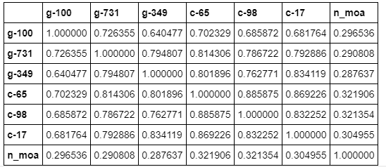
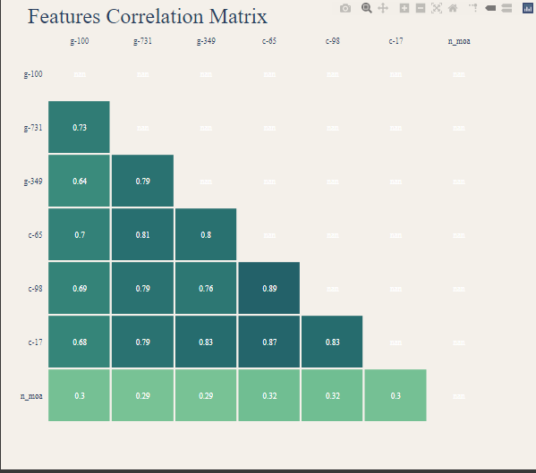
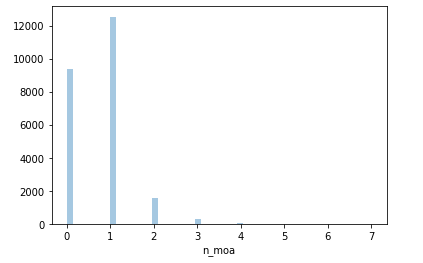
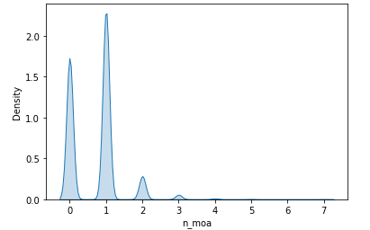
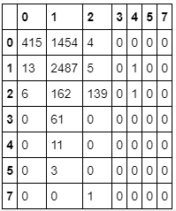

<h1 align="center">Ativações Químicas com ML</h1>

<h4 align="center"> 
	Concluído ✔️
</h4>

---

   <h2 align="center">Tópicos 📋</h2>

   

   
   - [Objetivo 📖](#objetivo-)
   - [Correlações 🛠️](#correlações-%EF%B8%8F)
   - [Gráficos e Distribuição 🏁](#gráficos-e-distribuição-)
   - [Modelos e Tunning 📲](#modelos-e-tunning-)
   - [Conclusão e trabalhos futuros 🤔](#conclusão-e-trabalhos-futuros-)

   

---

<h2 align="center">Objetivo 📖</h2>
   

  Com esses dados podemos tentar prever algumas informações, como por exemplo qual tipo de ativação poderá ocorrer para uma determinada assinatura de experimento, para o nosso trabalho vamos tentar prever o número de ativações para uma dada assinatura, ou seja, utilizando os dados do DataFrame, tabela dados_experimentos queremos prever a coluna n_moa do DataFrame, tabela dados_resultados

---

<h2 align="center">Correlações 🛠️</h2>

   

Antes de partimos para a modelagem podemos tentar entender um pouco melhor nossos dados, sobre tudo as correlações entre colunas com a coluna que queremos prever n_moa.
Com as informações das correlações podemos ver que algumas informações de genes como g-100, g-731 e g-349 possuem uma correlação mais positiva com o valor que queremos prever e as informações c-65, c-98, c17 possuem uma correlação negativa, por tanto são colunas importantes na hora de prever o nosso resultado esperado. Podemos tentar montar um modelo futuramente apenas utilizando as features com correlações positivas e negativas que sejam mais altas. Podemos ainda averiguar a correlação entre as colunas para cada coluna de nosso dataset

 

 

 

   

---

<h2 align="center">Gráficos e Distribuição 🏁</h2>

   

Antes de montarmos nosso modelo plotamos a distribuição das nossas classes de ativação.

 

 

Podemos ver que nossos dados não são muito bem distruibuidos, ou seja, não seguem uma distribuição normal e são altamente concentrados entre as os números 0 e 1, portanto é bem provável que nossos modelos irão erra muito prevendo classes que deveriam ser entre 2 a 7, como sendo algo entre 0 e 1.

   

---

<h2 align="center">Modelos e Tunning 📲</h2>

 
Para a nossa previssão vamos experimentar 3 algoritmos: RandomForestClassifier, ExtraTreesClassifier e DecisionTreeClassifier afim de validarmos como três modelos baseados em uma hierarquia de decisão em árvore irão se comportar e vamos utilizar o GridSearchCV do sklearn para tunar os modelos

   

---

<h2 align="center">Conclusão e trabalhos futuros 🤔</h2>

 
  Após o tunning e treino alcançamos os seguintes resultados:
  
  A precisão do modelo RandomForestRegressor nos dados de teste é de: 0.6456015116523199

  A precisão do modelo ExtraTreesRegressor nos dados de teste é de: 0.6451816082301071

  A precisão do modelo DecisionTreeRegressor nos dados de teste é de: 0.6384631534747008

  Alcançamos um resultado muito semelhante entre os três modelos, mesmo tunando os parâmetros, logo podemos concluir que neste cenário o melhor modelo possa ser o modelo mais simples, DecisionTreeClassifier, uma vez que este perfomou muito próximo aos demais modelos mais complexos, como o ganho na precisão não é relevante e o tempo de treino dos modelos é, a escolha do DecisionTreeClassifier é interessante em cenários com pouco poder de processamento e pouco tempo
 
 Para entendermos melhor como nosso modelo do DecisionTreeClassifier performa, podemos ver nossa matriz de confusão para saber onde estamos errando e acertando mais e posteriormente podemos tunar nosso modelo em busca de um modelo que erre mais uma classificação e acerte mais outras
 
 

 
 Como esperado vimos que o modelo tende a predizer a maior parte das vezes um resultado entre as classes 0 e 1, tendendo mais fortemente a classificações na classe 1. Quando olhamos as assinaturas que deveriam ser previstas como 1, vimos que o modelo acerta 2487 de 2506, ou seja, errando apenas 19. Já para os números de ativações maior que 2, o modelo errou todas as predições.

Fica claro que uma das nossas maiores limitações é por conta do modelo altamente desbalanceado, para trabalhos futuros podemos tentar aplicar alguma forma de normalização em busca de uma distribuição mais normal ou aplicarmos algoritmos que sejam específicos para problemas de classes desbalançeadas.

Além disso, podemos também posteriormente desenvolver modelos utilizando apenas as featues com correlação alta com a coluna que queremos predizer

   link: **[COLAB](https://colab.research.google.com/drive/1v3Sc_HNnxpFqW3pFE1sqQSXgbM8BLPrL?usp=sharing)**
   

---

## 💪 Como contribuir para o projeto

1. Faça um **fork** do projeto.
2. Crie uma nova branch com as suas alterações: `git checkout -b my-feature`
3. Salve as alterações e crie uma mensagem de commit contando o que você fez: `git commit -m "feature: My new feature"`
4. Envie as suas alterações: `git push origin my-feature`

---

   ## 🦸 Autor

   Este projeto foi desenvolvido com o ❤️ por **[@Ícaro Coêlho](https://github.com/icarogga?tab=following)** 👋🏽 Entre em contato!
   
    

---

## 📝 Licença

Este projeto esta sobe a licença [MIT](./LICENSE).

---

